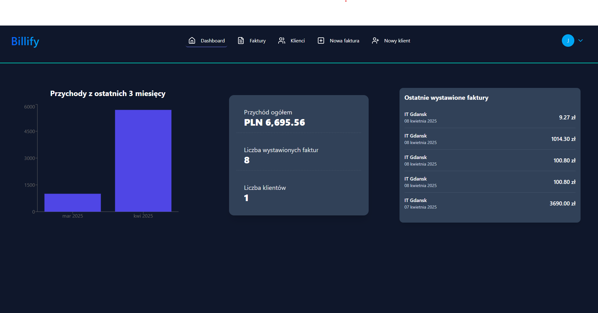
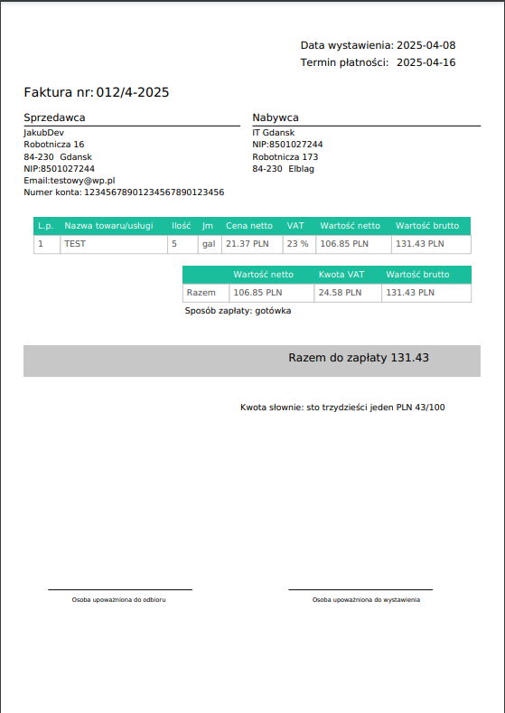

# Billify App


An application for managing invoices, allowing users to create, edit, download invoices in PDF format, and manage clients. The system is adapted for Polish tax regulations, including Polish NIP (tax identification number) validation.

## Features

- **User Authentication**: Registration, login, logout, profile updates.
- **Client Management**: Add, edit, and delete clients.
- **Invoices**: Create invoices and download them in PDF format.
- **Data Validation**: Handling of correct data formats (e.g., IBAN, Polish NIP).
- **Responsive Interface**: User-friendly design.

## Technologies

- **Frontend**: React, Zustand, TailwindCSS
- **Backend**: Node.js, Express.js
- **Database**: MongoDB
- **Other**: Axios, React Hot Toast, Lucide Icons

## Installation

1. Clone the repository:
   ```bash
   git clone https://github.com/your-username/your-repo.git
   cd your-repo
   ```

2. Install server dependencies:
   ```bash
   cd server
   npm install
   ```

3. Install client dependencies:
   ```bash
   cd ../client
   npm install
   ```

4. Configure the .env file in the server directory:
   ```
   MONGO_URI=your_mongodb_connection_string
   JWT_SECRET=your_jwt_secret
   PORT=your_port
   ```

5. Run the application:
    * Server:
      ```bash
      cd server
      npm run dev
      ```
    * Client:
      ```bash
      cd client
      npm run dev
      ```
## Dashboard


## Invoice Example


## Author

Project created by Jakub Masalski

## License

This project is licensed under the MIT License. See the LICENSE file for details.